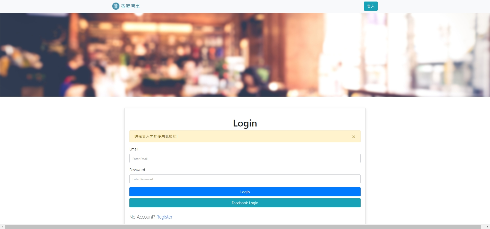

# Restaurant list (Update 2022/1/8)
這是一個使用node.js及express框架所架構的餐廳網站，在這裡可以您可以瀏覽該網站全部的餐廳詳細資訊且可使用查詢快速查找您所喜歡的餐廳。

## 專案畫面



## Features 產品功能
1. 使用者需使用email或facebook註冊才可登入
2. 使用者可以新增專屬自已的餐廳資料
3. 使用者可以刪除專屬自已的餐廳資料
4. 使用者可以修改專屬自已的餐廳詳細資料
5. 使用者點擊餐廰圖片或Detail按鈕即可觀看該餐廳詳細資訊
6. 使用者可使用搜尋表單輸入想搜尋的關於該餐廳的名稱或種類關鍵字搜尋餐廳
3. 使用者搜尋的關鍵字無符合餐廳，會顯示沒有符合的資訊給使用者

7. 使用者可以使用排序欄位對資料進行排序

## Environment Setup 環境建置
* Node.js： ^14.16.0
* Express： ^4.17.1
* Express-handlebars： ^5.3.4
* express-session": ^1.17.2
* passport: "^0.5.2
* passport-facebook: ^3.0.0
* passport-local": ^1.0.0
* bcryptjs: ^2.4.3
* connect-flash: ^0.1.1
* dotenv: ^10.0.0
* method-override: ^3.0.0
* mongoose： ^6.0.12
* mongodb

## Installing 專案安裝流程
1. 打開您的終端機(terminal)，複製(clone)專案至本機
```
git clone https://github.com/deansyue/restaurant_list.git
```

2. 進入存放此專案資料夾
```
cd restaurant_list
```

3. 安裝npm套件
```
npm install
```

4. 使用腳本，創建種子資料
```
npm run seed
```

5. 使用腳本，即可啟動伺服器
```
npm run dev
```

6. 當終端機(terminal)出現以下文字，代表伺服器已啟動
```
Express is running on http://localhost:3000
```

## 內建使用者
可以用種子資料內使用者進行登入
```
user1
  email: user1@example.com
  password: 12345678
```
```
user2
  email: user2@example.com
  password: 12345678
```

## Contributor 專案開發人員
[deansyue](https://github.com/deansyue)
